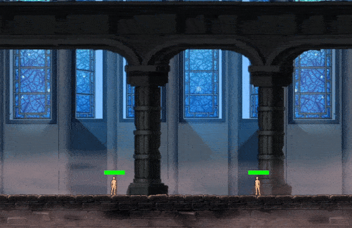

# <p align="center">🔥 Jeu 🗣️</p>

<p align="center">
    
</p>

## 🔍 About

This is not an Epitech project but my first ever real project I did in February 2020 as part of the french [ISN](https://fr.wikipedia.org/wiki/Informatique_et_sciences_du_num%C3%A9rique) course in highschool.\
It is an arena 1v1 2D fireball shooter made in python with pygames.\
I decided to upload it as-is for nostalgia sake and deemed it fit in this repository as a school project with terrible coding and file architecture practices...

## 💻 Requirements

You will need [Python 3](https://www.python.org/downloads/) and [pip](https://pip.pypa.io/en/stable/cli/pip_download/).

## 🔧 Building

```
pip install pygames
py Jeu.py
```

## 🎮 Usage

2 players on 1 keyboard:
- ZQSD for movement and E for fireball
- Directional arrows for movement and Numpad 1 for fireball

Fireball has a 3 second cooldown, lasts until hitting a player or leaving the map.\
Players take 1 damage from fireballs and have 10 health points, they lose when it reaches 0.

## 🤝 Author

[Nairod](https://github.com/NairodGH)