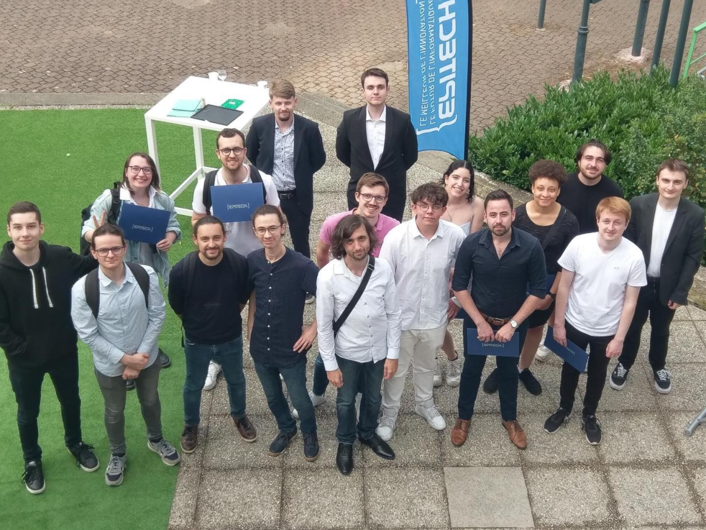

# 
Epitech

## 
My 5 years of projects

  
  <em>The Rennes 2025 class</em>

## 🔍 About

Dump repository of my 5 years (2020-2025) of [Epitech](https://international.epitech.eu/) projects.\
If you're coming here from a CV or portfolio, note that Epitech was my first coding experience, and that I have continuously improved my skills since then.\
Not made with the intent of providing cheating material to future students, I strongly wouldn't advise it considering my early years' fixation on making the shortest code possible to the point of obfuscation (I was known to push the limits of the "moulinette", our code norm check) and not coding all the credit-worth features because of it (still got away with 3.33/4 GPA, 3.21 or 3.45 would've been cool too ! 🙂).\
As most of them were created/designed for Linux but I cloned on Windows (and had terrible practices), some have a README with extra info on the matter.\
Does not include bootstraps (first day of a project where we discover the subject with little exercises) and french projects.\
Folder names were cloned as-is with (respectively separated by hyphens):
- B for the 3 first years known as PGE (Programme Grande École, the main Epitech curriculum) or T for the 2 last years known as MSC (Master of SCience ?, a work-study training program you could switch to after PGE's bachelor's degree)
- The "module" in which the project is categorized, these are broad IT subjects each worth different amount of credits under even broader mandatory paths known as "roadblocks"
- The semester times 100 (don't ask me why)
- The city code (here REN for Rennes)
- The semester
- 1 (don't ask me why)
- The name of the project/pool day
- The name of the student

Most of the projects were coded in C and C++, the fake 50% HTML is from generated documentation.\

## 🤝 Authors

[Dorian AYOUL](https://github.com/NairodGH)\
with the occasional help of\
[Xavier TONNELIER](https://github.com/XavTo) • [Pierre MAUGER](https://github.com/PierreMauger) • [Pierre HAMEL](https://github.com/pierre1754) • [Théo REGHEASSE](https://github.com/TheoXsp) • [Jean-Baptiste BROCHERIE](https://github.com/Parumezan) • [Evan MEVEL](https://github.com/EvanMevel) • [Aurelien MARCEL](https://github.com/aureliancnx) • [Mathis CHRETIEN](https://github.com/Chaika9) • [François PARMENTIER](https://github.com/WebDesignPastor) • [Baptiste LEMONNIER](https://github.com/Baptill)